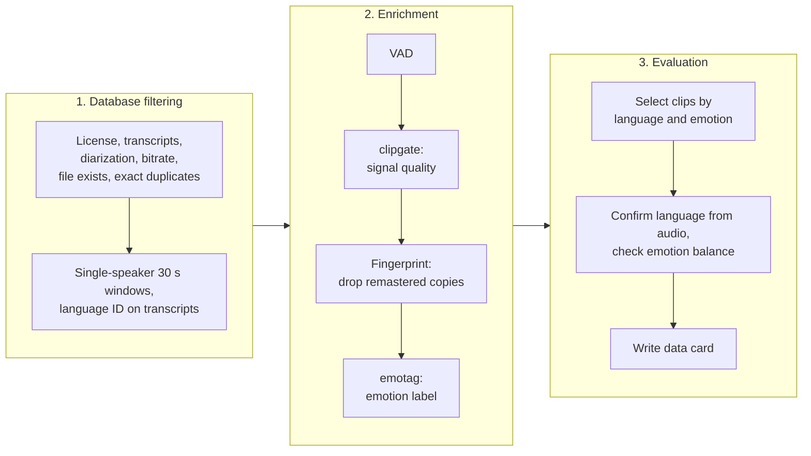

# Take-home Assignment

Two components of the pipeline for the 5,000-clip delivery.

## Pipeline



1. **Database filtering** uses catalog tables only, so no audio is read. It keeps licensed files that have transcripts and diarization, drops exact duplicate files by hash, and cuts candidate 30 s single-speaker windows in the four languages.
2. **Enrichment** reads audio for those candidates and adds what the catalog lacks: speech segments, signal quality measurements, audio fingerprints and emotion labels. Files that fail the quality check, and remastered copies of the same recording, are dropped before emotion tagging.
3. **Evaluation** selects the final 5,000 clips and checks that the set meets the order: the right language, and coverage across emotions and languages. The results are reported in a data card.

## Working demos:

**clipgate** measures signal quality with plain DSP and returns PASS, FLAG or REJECT with reasons. Its core check is effective bandwidth, the frequency where content actually stops. Catalog metadata can't provide this. The telephone archive is stored at 44.1 kHz, but its content ends near 3.4 kHz. clipgate finds the edge as the sharpest drop in the spectrum, which works whether the empty band above it is silent or full of tape hiss. It rejects both telephone variants in the demo, and it runs at ~400x realtime on one CPU core.

**emotag** assigns one emotion label per 30 s clip. It scores each speech segment and takes a vote, so short emotional peaks aren't averaged away. A consistency score flags clips that don't carry a single emotion. The model is emotion2vec+ large, chosen because it's trained for speech emotion across languages, runs locally (partner audio stays in-house), and is licensed for commercial use. On acted test sets it reaches ~0.86 to 0.90 accuracy in English, French and Italian, but only 0.50 in Spanish.

## Possible Next Steps:

- Speech/music detection, deduplication and audio language ID. These are in the pipeline design but not implemented.
- Human verification of emotion labels. It isn't feasible in 4 days, so all labels are model labels.
- Tuning on catalog audio. The cutoffs in both components are starting values, not yet tested on Protege's data.


## Run

```
pip install -r clipgate/requirements.txt -r emotag/requirements.txt
cd clipgate && python -m pytest -q && python demo.py
cd ../emotag && python -m pytest -q
```
